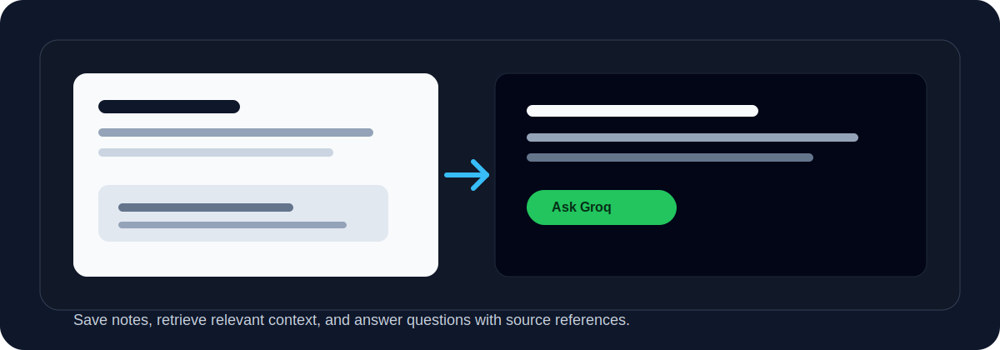
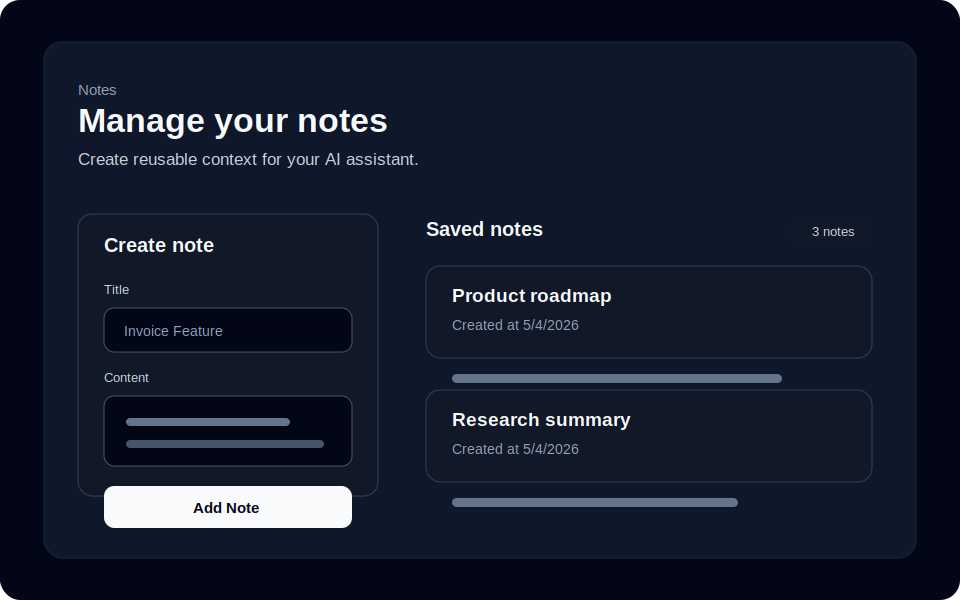
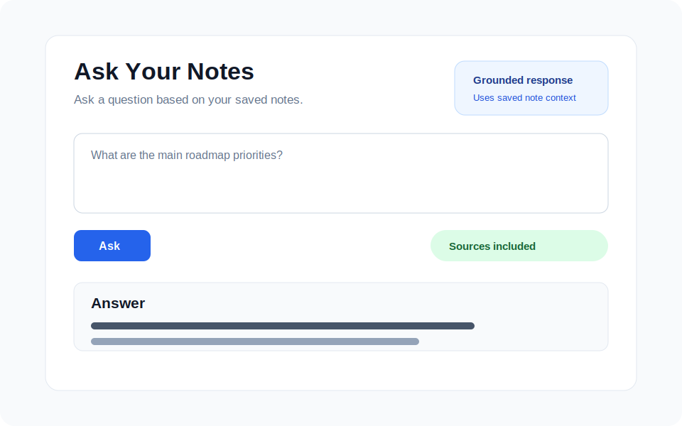

# Groq AI Notes Assistant



A Next.js notes and document assistant with a Groq-powered question-answering workflow. Users can save notes, upload documents, ask questions about their saved content, and receive grounded answers with source references.

The app stores notes and extracted document chunks in SQLite through Prisma, retrieves relevant chunks with lightweight keyword matching, and sends the selected context to Groq for answer generation.

## Preview

| Notes | Ask AI |
| ----- | ------ |
|  |  |

## Features

- **Note management** - Create, list, and delete notes with a title, content, and creation date.
- **Document upload** - Upload TXT, Markdown, CSV, JSON, PDF, and DOCX files from the Notes screen.
- **PDF and DOCX extraction** - Extract readable text from PDFs with `pdf-parse` and Word documents with `mammoth`.
- **Chunked retrieval** - Split long notes and uploaded documents into searchable chunks before answering.
- **Question answering** - Ask a question and receive an answer generated from the most relevant saved notes or document chunks.
- **Source references** - View the note or document chunks that were used as context for each AI answer.
- **Grounded responses** - The system prompt instructs the model to answer only from provided notes and acknowledge when information is missing.

## Tech stack

| Layer        | Choice                                      |
| ------------ | ------------------------------------------- |
| Framework    | Next.js 16 (App Router)                     |
| UI           | React 19, Tailwind CSS 4                    |
| Database     | SQLite (`DATABASE_URL` in Prisma)           |
| ORM          | Prisma 6                                    |
| AI           | [Groq API](https://console.groq.com/) via `groq-sdk` |
| Documents    | `pdf-parse` for PDFs, `mammoth` for DOCX files |

## How it works

1. Users create notes manually or upload documents from the Notes page.
2. Uploaded files are converted to text. Text-like files use the native `File.text()` API, PDFs use `pdf-parse`, and DOCX files use `mammoth`.
3. The extracted text is saved as a `Note`, then split into overlapping `DocumentChunk` records for better retrieval.
4. When a question is submitted, the API searches document chunks first and falls back to older notes that do not have chunks.
5. Each candidate chunk is scored by whole-word overlap between the question terms and the candidate title/content.
6. The highest-scoring chunks are formatted as context and sent to Groq chat completions.
7. The response includes the generated answer and the chunks used as sources.

This intentionally uses simple keyword retrieval rather than embeddings or a vector database, keeping the project easy to understand and run locally. The chunk table makes long documents more practical without adding a separate search service.

## Supported uploads

| Format | Extension | Extraction method |
| ------ | --------- | ----------------- |
| Plain text | `.txt` | Native `File.text()` |
| Markdown | `.md`, `.markdown` | Native `File.text()` |
| CSV | `.csv` | Native `File.text()` |
| JSON | `.json` | Native `File.text()` |
| PDF | `.pdf` | `pdf-parse` |
| Word document | `.docx` | `mammoth` |

Uploads are limited to 10 MB. PDFs are parsed in the Node.js route runtime, with the PDF worker explicitly pointed at the installed `pdfjs-dist` worker file so Next/Turbopack can run extraction reliably.

## Prerequisites

- **Node.js** 20+
- A **Groq API key** from [Groq Console → API Keys](https://console.groq.com/keys)

## Getting started

### 1. Install dependencies

```bash
npm install
```

### 2. Environment variables

Copy the sample environment file and set your Groq API key:

```bash
cp env.example .env
```

Edit `.env` locally. Do not commit secrets.

The template includes:

| Variable | Required | Description |
| -------- | -------- | ----------- |
| `DATABASE_URL` | Yes | SQLite path (see `env.example`; default `file:./dev.db`) |
| `GROQ_API_KEY` | Yes | From [Groq Console → API Keys](https://console.groq.com/keys) |
| `GROQ_CHAT_MODEL` | No | Chat model ID; defaults to `llama-3.1-8b-instant` in code if unset |

To list the models available to your Groq API key:

```bash
curl https://api.groq.com/openai/v1/models \
  -H "Authorization: Bearer YOUR_GROQ_API_KEY"
```

### 3. Set up the database

Generate the Prisma client and apply migrations:

```bash
npx prisma generate
npx prisma migrate dev
```

After schema changes, create a named migration:

```bash
npx prisma migrate dev --name your_migration_name
```

Optional: open Prisma Studio to inspect local data.

```bash
npx prisma studio
```

### 4. Run the app

```bash
npm run dev
```

Open [http://localhost:3000](http://localhost:3000). Use **Notes** to add content or upload documents, then use **Ask AI** to query your saved notes and document chunks.

## Scripts

| Command         | Description              |
| --------------- | ------------------------ |
| `npm run dev`   | Start the dev server     |
| `npm run build` | Create a production build |
| `npm run start` | Run the production server |
| `npm run lint`  | Run ESLint               |

## HTTP API

| Method | Path | Description |
| ------ | ---- | ----------- |
| `GET` | `/api/notes` | List all notes, newest first |
| `POST` | `/api/notes` | Create a note from `title` and `content`; also creates searchable chunks |
| `DELETE` | `/api/notes/{id}` | Delete a note by ID; related chunks are deleted automatically |
| `POST` | `/api/docs/upload` | Upload a document file, extract text, save it as a note, and create chunks |
| `POST` | `/api/ask` | Ask a question using saved notes, document chunks, and Groq |

Successful responses generally include a `success` boolean where applicable; validation errors use `4xx` with a `message` field.

## Project structure

```
app/
  api/ask/route.ts          # Groq + chunk/note retrieval
  api/docs/upload/route.ts  # Document upload and text extraction
  api/notes/                # CRUD API for notes
  ask/page.tsx          # Ask UI
  notes/page.tsx        # Notes UI
  page.tsx              # Landing
lib/
  documentChunks.ts     # Text normalization and chunking
  prisma.ts             # Singleton Prisma client
prisma/
  schema.prisma         # Note and DocumentChunk models
  migrations/           # SQL migrations
```

## Limitations

- Retrieval is based on keyword overlap, not semantic similarity.
- Notes or document chunks with relevant meaning but different wording may not be selected as sources.
- PDF extraction works for text-based PDFs. Scanned image-only PDFs need OCR, which is not included.
- DOCX extraction reads document text but does not preserve every layout detail.
- The app does not currently include authentication or per-user note separation.
- The AI response quality depends on the retrieved chunks and the configured Groq model.

## Deployment notes

- Set `DATABASE_URL` to a persistent database location. Many serverless hosts do not provide durable local SQLite storage by default.
- For production deployments, consider switching Prisma to another [supported database](https://www.prisma.io/docs/orm/reference/supported-databases).
- Configure `GROQ_API_KEY` and optionally `GROQ_CHAT_MODEL` in your hosting environment. Never expose the Groq API key in client-side code.
- Run `npx prisma migrate deploy` in CI or release pipelines when using Prisma migrations.

## Learn more

- [Next.js documentation](https://nextjs.org/docs)
- [Prisma documentation](https://www.prisma.io/docs)
- [Groq API](https://console.groq.com/docs)
